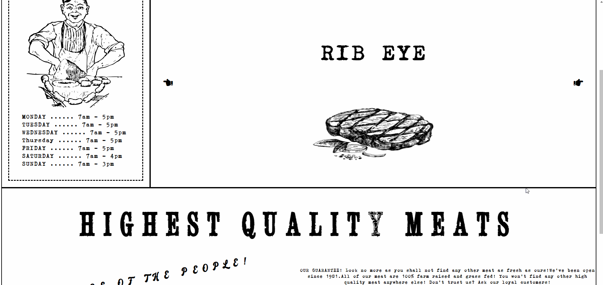
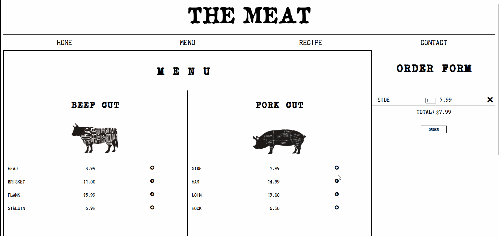
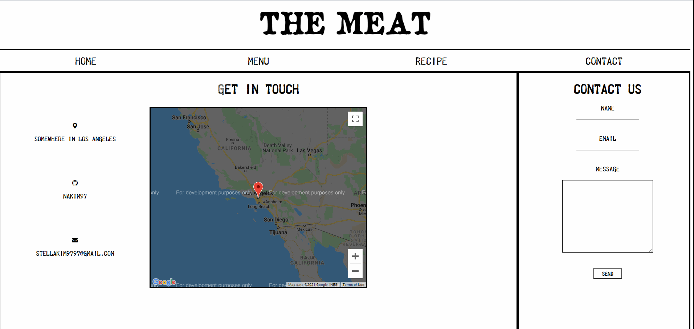

# ButcherShop
https://butchershop-nakim97.netlify.app/

This is a personal project of an implementation of a Butcher Shop website. The purpose of this project was to become more comfortable with HTML/CSS/Javascript while having some fun implementing an old-fashioned newspaper design. The design of the website was inspired by the video game, Red Dead Redemption 2's Catalogue Menu Design as well as the website, SeaHarvest.

## Tech Stack
HTML, CSS , Javascript , RESTFUL API 

## Walkthrough

- Showcasing Home Page which displays custom image slider, advertisement, and store hours

- Showcasing Order Page where users can view the menu, add/delete/edit items to cart, and purchase

- Showcasing Recipe Search Page where users can search for a recipe by typing keywords ( fetched from EDAMAM API) 

- Showcasing Contact Page where users can fill out a contact form & view store's location (Google Maps API)

## Features

The following features are implemented:

* [X] Image Slider Carousel that displays hot selling items of the day
* [X] Users can add/update/remove/purchase items from order page and the total price will be updated
* [X] Recipe Data is fetched from EDAMAM API such that users can search up recipes
* [X] Contact Form along with Google Maps API implemented to display location
* [X] Responsive Design 

***Photos used in this project are taken from HiClipart, non-copyrighted and are not used for commercial use. 
